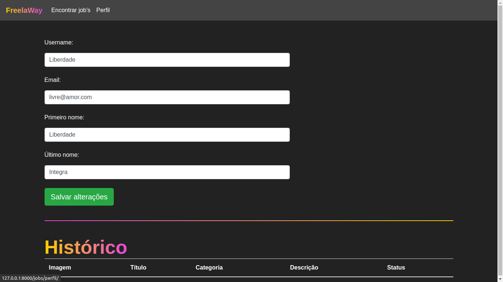

# PystackWeek3.0_Freelaway
-
<h1 align="center">
  
</h1>

# Plataforma de Jobs
- Repositório contendo o código de um projeto da Pystack Week 3.0 da [Pythonando][pythonando], focado no desenvolvimendo back-end com o uso do framework django, não deixando de ser uma aplicação bonita e completa.
- A aplicação desenvolvida tem por finalidade gerenciar propostas de jobs freelancers.

## 📷 Imagens

<kbd>
  
</kbd>

<kbd>
  
</kbd>

<kbd>
  
</kbd>

<kbd>
  
</kbd>

[pythonando]: https://pythonando.com.br/
[django]: https://www.djangoproject.com/
