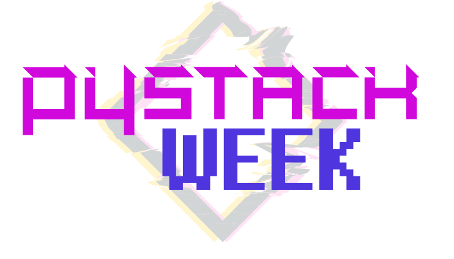
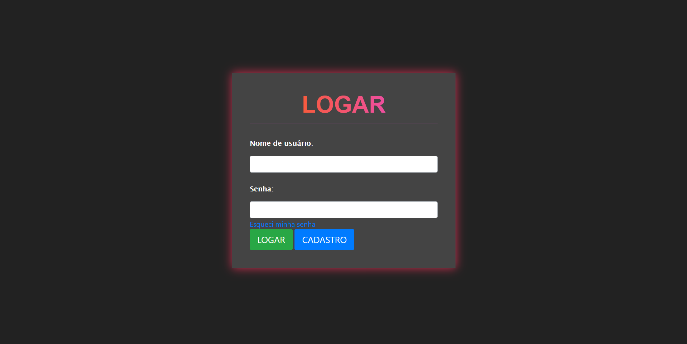
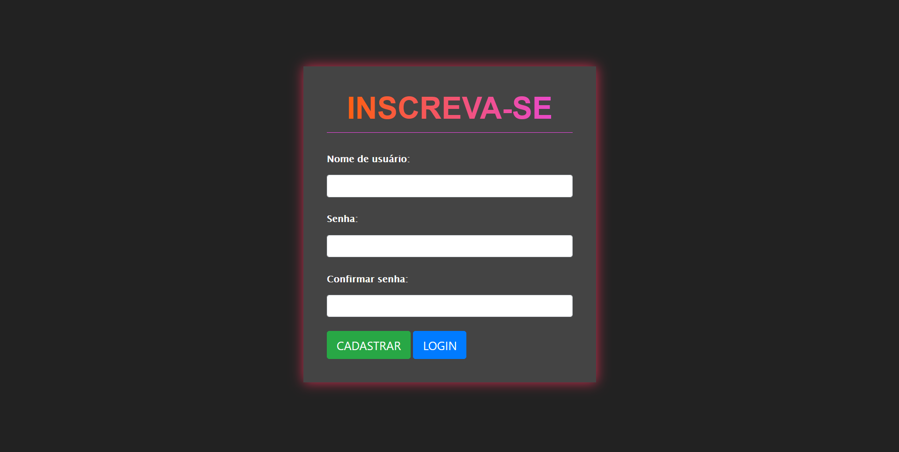
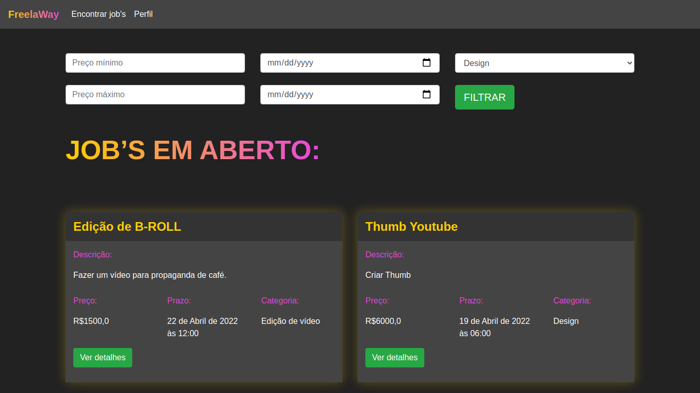

<p align='center'></p>
<h1 align='center'>FreelaWay</h1>
<p align='center'>Plataforma de busca e contratação de mão de obra freelancer/ informal, desenvolvida durante a terceira edição do evento PyStack Week, conduzida pelo professor Caio Sampaio.</p>

<div align='center'>
  
  
  
  
</div>

## Rode localmente
1. Clone o repositório:
```bash
  git clone https://github.com/amanmdest/psw3_Freelaway.git
```
2. Instale dependências(recomenda-se ter um ambiente virtual para as instalações, neste projeto utilizei o Pyenv):
```bash
  pip install -r requirements.txt
```
4. Migrações Banco de Dados:
```bash
  python manage.py makemigrations
  python manage.py migrate
```
5. Para poder usar o painel do admin é preciso criar um superuser:
```bash
  python manage.py createsuperuser
```
6. Rode o projeto localmente:
```bash
  python manage.py runserver
```
e acesse: http://127.0.0.1:8000/

### Interface da Aplicação
<kbd>
  
</kbd>  
<kbd>
  
</kbd>
<kbd>
    
</kbd>
